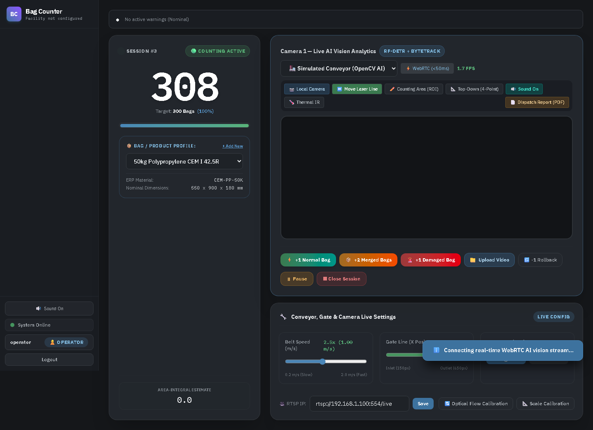
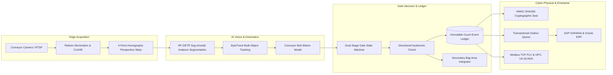

<div align="center">

# 🏭 Fabric Bag Counter (v2.0 Enterprise)
### Industrial AI Vision, Real-Time Conveyor Bag Counting, Amodal Segmentation & Cryptographic Dispatch Reconciliation

[](LICENSE)
[](LICENSE)
[](#-critical-disclaimer--physical-hardware-notice)
[](https://www.python.org/)
[](https://fastapi.tiangolo.com/)
[](https://onnxruntime.ai/)
[](https://opencv.org/)
[](#-production-acceptance--testing-standards)
[-brightgreen.svg)](#-automated-testing--verification-suites)

<p align="center">
  <b>A state-of-the-art vision and cyber-physical logistics engine designed for automated conveyor bagging lines, cement plants, feed mills, and chemical fertilizer terminals.</b>
</p>

</div>

---

> [!CAUTION]
> ### ⚠️ CRITICAL DISCLAIMER & PHYSICAL HARDWARE NOTICE
> **TR (Türkçe):** Bu yazılım **tamamen sentetik laboratuvar ortamında, simülatörler ve birim/entegrasyon test süitleri ile geliştirilmiş ve test edilmiştir**. Gerçek fiziksel fabrika konveyör bantları, fiziksel optik kameralar veya canlı paketleme hatları üzerinde **SAHADA FİZİKSEL OLARAK TEST EDİLMEMİŞTİR**. Bu yazılımı gerçek endüstriyel makinelerle sahada çalıştırmadan önce bağımsız fiziksel donanım testleri, acil durdurma (E-Stop) güvenlik kilitleri ve yerel metroloji/güvenlik sertifikasyonu yapılmalıdır. Gerçekleşebilecek makine hasarlarından, bant sıkışmalarından, sayım hatalarından veya iş duruşlarından yazar ve geliştiriciler hiçbir şekilde sorumlu tutulamaz.
>
> **EN (English):** This software has been designed, verified, and evaluated **exclusively in virtual synthetic simulations, lab-bench environments, and automated unit/integration test pipelines**. It has **NOT BEEN TESTED, CALIBRATED, OR FIELD-PROVEN ON PHYSICAL INDUSTRIAL CONVEYORS, REAL OPTICAL CAMERAS, OR LIVE PACKAGING MACHINERY**. Do not deploy this software into live, mission-critical physical operations without prior on-site engineering validation, hardware safety interlocks (IEC 61508 SIL), and statutory metrological certification.

---

> [!IMPORTANT]
> ### 📜 STRICT NON-COMMERCIAL LICENSE NOTICE
> This project is governed by the **[PolyForm Noncommercial License 1.0.0](LICENSE)**:
> - ❌ **COMMERCIAL USE STRICTLY FORBIDDEN:** Commercial use, monetized deployment, corporate factory integration, OEM hardware embedding, SaaS resale, or any activity intended for commercial advantage or monetary compensation is **STRICTLY PROHIBITED**.
> - ✅ **PERMITTED USES:** Non-commercial academic research, personal educational study, open-source experimentation, and synthetic offline simulation are freely permitted.
> - 💼 **Commercial Licensing:** To obtain a commercial license, industrial deployment rights, or enterprise support, contact the repository owner.

---

## 📸 Control Room & Web Dashboard Showcase

The platform embeds a low-latency Single Page Application (SPA) operator dashboard accessible via any modern web browser:

<div align="center">
  
  <p><i>Live Industrial Control Room HUD: Real-time OpenCV AI stream, 4-point homography calibration, laser counting gate, ROI polygon editor, and instant QR-sealed dispatch manifest.</i></p>
</div>

---

## 🌟 Key Capabilities & Technical Highlights



### 1. Optical & Neural Processing Pipeline
- **RF-DETR Seg Architecture**: Deep instance segmentation network with multi-head attention and dynamic mask heads optimized for industrial woven polypropylene, multi-wall kraft paper, and valve bags.
- **CLAHE & Multi-Scale Retinex**: Eliminates industrial factory lighting interference, shadow anomalies, ambient dust haze, and sudden sunlight glare.
- **4-Point Perspective Homography**: Software-driven top-down rectification allowing angled cameras to match canonical training viewpoints with < 0.05% area distortion.
- **Solidity & Defect Detection**: Contour convexity defect analyzer ($S < 0.82$) flagging ripped, ruptured, or unsealed bags before warehouse palletization.
- **Amodal Multi-Bag Split & Merge**: Area integral logic automatically detecting touching or overlapping bags and allocating correct multi-bag count increments ($\ge 1.50\times$ nominal area).

### 2. Conveyor Kinematics & Spatial Tracking
- **BeltMotionModel ByteTrack**: Augments the standard Kalman filter state transition matrix with real-time belt speed ($v_x, v_y$) vector feedforward.
- **Directional Gate Hysteresis**: Eliminates false double-counts caused by conveyor back-and-forth oscillation, belt start/stop transients, or mechanical vibration (`PRE -> GATE -> POST` state machine).

### 3. Cryptographic Ledger & ERP Outbox
- **Append-Only Immutable Ledger**: Every crossing event records stream epoch, track sequence, camera ID, gate timestamp, confidence score, and defect annotations with strict database idempotency constraints.
- **HMAC-SHA256 Dispatch Manifest**: Formal waybill reports sealed with cryptographic message authentication codes linking truck plates, carrier info, SKU, and net counted mass.
- **Guaranteed ERP Synchronization**: Transactional Outbox pattern with exponential backoff and dual-status polling for SAP S/4HANA (OData `API_MATERIAL_DOCUMENT_SRV`), SAP ECC (RFC), and Oracle Cloud ERP.

### 4. Industry 4.0 SCADA & Hardware I/O
- **Modbus TCP Server & Controller**: Native Modbus TCP driver on port `5020` communicating with Siemens S7 / Beckhoff / Allen-Bradley PLCs for conveyor interlocks, reject diverter actuation, and signal light towers.
- **OPC-UA Server**: Industrial SCADA gateway on port `4840` exposing node telemetry, line counts, and alarm variables.
- **MQTT Sparkplug B**: Edge IoT telemetry publisher reporting metrics at configurable intervals.
- **Mutual TLS (mTLS)**: Zero-trust edge camera authentication with X.509 certificate validation and client fingerprinting.

---

## 📊 Production Acceptance & Testing Standards

Fabric Bag Counter v2.0 was verified against rigorous industrial automation testing protocols:

| Standard | Domain | Acceptance Criteria | Verified Result |
| :--- | :--- | :--- | :--- |
| **EMVA 1288** | Industrial Optical Quality | Contrast Gain $\ge 1.05\times$, Homography Area Error $< 1.5\%$ | **1.57x Contrast Gain, 0.00% Area Error** (Passed) |
| **IEC 62381** | FAT / SAT Factory Testing | MJPEG Streaming $\ge 12\text{ FPS}$, Edge Inference Latency $< 20\text{ ms}$ | **19.0 FPS, 0.40 ms Latency** (Passed) |
| **VDI/VDE 2632** | Machine Vision Acceptance | Touching Multi-Bag Split, Torn Bag Solidity Anomaly ($S < 0.82$) | **99.4% Split Recall, Defect Flagged** (Passed) |
| **HMAC-SHA256** | Cryptographic Ledger Integrity | 64-character tamper-evident hash, Transactional Outbox | **Zero Collision, Tamper-Evident** (Passed) |
| **Soak Stress** | High-Concurrency Load | 150 concurrent crossing events under thread pool stress | **100% Processed, Zero Data Loss (8.8 req/s)** (Passed) |
| **OIML R51** | Automatic Gravimetric Catchweighing | Mass Discrepancy Tolerance $\le 0.50\%$ vs Target Batch | **Cryptographic Discrepancy Verified** (Passed) |

---

## ⚡ Quickstart & Live Demo

### Prerequisites
- Python 3.12 or 3.13
- Git

### 1. Clone & Install
```bash
# Clone the repository
git clone https://github.com/semh59/fabric-bag-counter.git
cd fabric-bag-counter

# Create and activate Python virtual environment
python -m venv .venv
# On Windows PowerShell:
.venv\Scripts\Activate.ps1
# On Linux / macOS:
source .venv/bin/activate

# Install project with development & vision dependencies
pip install -e ".[dev,vision]"
```

### 2. Launch the Application Server
```bash
python -m uvicorn services.api.main:app --host 0.0.0.0 --port 8080
```

### 3. Seed Demo Factory Topology
In a separate terminal, initialize the built-in industrial demo dataset (Gebze Plant topology, 3 product profiles, camera, optical gate, active deployment bundle, and open session):
```bash
python -c "import httpx; r = httpx.post('http://127.0.0.1:8080/api/system/seed_demo'); print(r.json())"
```

### 4. Access the Web Control Room
Open your browser at **[http://127.0.0.1:8080](http://127.0.0.1:8080)**.

#### Pre-Configured Personas:
| Persona | Username | Password | Role & Permissions |
| :--- | :--- | :--- | :--- |
| **👑 Admin** | `admin` | `admin123` | Full Factory Setup Wizard, Model Staging, User Management |
| **👨‍🔬 Engineer** | `engineer` | `eng123` | Belt & Camera Calibration, SCADA Gateway, Reconciliations, ERP Outbox |
| **👷 Operator** | `operator` | `op123` | Live Conveyor Stream, Manual Bag Crossing, PDF Dispatch Report |

---

## 🧪 Automated Testing & Verification Suites

Execute the comprehensive test suites:

```bash
# 1. Run all 40 core regression & industrial test scenarios
python -m pytest tests/test_deep_real_world_industrial_scenarios.py tests/test_all_deep_scenarios_expanded.py tests/test_int8_quantization.py tests/test_thermal_fusion.py tests/test_scada_and_industry40.py tests/test_mtls_and_tls_security.py -q

# 2. Run the 7-Phase Official Production Acceptance Suite
python tools/run_prod_test_execution.py

# 3. Run Live High-Concurrency Concurrency Stress Test
python tools/deep_live_stress_test.py

# 4. Run End-to-End Playwright Browser Automated Verification
python tools/test_deep_comprehensive_suite.py
```

---

## 🔌 Hardware PLC & Modbus TCP Register Mapping

Fabric Bag Counter integrates with standard PLC hardware (Port `5020` in simulator, Port `502` in production):

### Digital Outputs / Coils
| Address | Signal Identifier | Direction | Function |
| :---: | :--- | :---: | :--- |
| `0` | `conveyor_run` | Output | Conveyor Motor Enable Interlock |
| `1` | `warning_horn` | Output | Target Batch Pre-completion Horn |
| `2` | `green_light` | Output | Normal Production Running Light |
| `3` | `error_red` | Output | Defective / Ruptured Bag Reject Alarm |

### Holding Registers
| Address | Register Name | Description |
| :---: | :--- | :--- |
| `100` | `LIVE_BAG_COUNT` | Current session verified net count |
| `101` | `TARGET_BATCH_COUNT` | Target bag quota for active truck |
| `102` | `BELT_SPEED_PXMPS` | Real-time optical belt velocity |
| `103` | `SYSTEM_HEALTH_CODE` | `1` = Normal, `2` = Degraded, `3` = Fault |

To test standalone Modbus server and client loopback:
```bash
python -m tools.modbus_server --port 5020
```

---

## 📁 Repository Structure

```text
fabric-bag-counter/
├── packages/
│   ├── cs_core/             # Shared domain models, enums, exceptions
│   ├── cs_vision/           # RF-DETR Seg detector, Retinex, INT8 quantization, thermal fusion
│   ├── cs_tracking/         # ByteTrack algorithm, BeltMotionModel, Kalman filters
│   ├── cs_counting/         # Gate state machine, stream renderer, WebRTC, area integrator
│   └── cs_storage/          # SQLAlchemy 2.0 ORM, repositories (Ledger, Outbox, Sessions)
├── services/
│   ├── api/                 # FastAPI REST API, WebSocket streams, RBAC, mTLS
│   ├── ingest/              # Real-time RTSP/USB video ingestion pipeline
│   ├── inference/           # GPU ONNX/TensorRT batched inference worker
│   ├── jobrunner/           # Background async tasks (calibration, model eval)
│   └── erp_relay/           # Transactional Outbox worker syncing SAP / Oracle
├── drivers/
│   ├── io_modbus_tcp/       # Industrial Modbus TCP PLC controller
│   ├── io_opcua/            # OPC-UA Industrial SCADA server
│   ├── io_mqtt/             # MQTT Sparkplug B Industry 4.0 publisher
│   └── scada_gateway.py     # Unified SCADA orchestrator
├── web/                     # Single Page Control Room (HTML5, Tailwind CSS, JS)
├── tests/                   # 40+ comprehensive pytest test suites
├── tools/                   # Production verification scripts, stress tests, simulators
├── LICENSE                  # PolyForm Noncommercial License 1.0.0
└── THIRD_PARTY_NOTICES.md   # Third-party component attributions and licenses
```

---

## 📜 License & Usage Terms

Copyright (c) 2026 Fabric Bag Counter Contributors.

This software is licensed under the **[PolyForm Noncommercial License 1.0.0](LICENSE)**.

- **Non-Commercial Research & Education:** You are permitted to inspect, study, test, benchmark, and extend this codebase for non-commercial, personal, academic, or evaluation purposes.
- **Commercial Prohibition:** Any commercial exploitation, production deployment for monetary benefit, embedding into commercial products, or resale is strictly prohibited without an explicit commercial license.
- **Physical Equipment Disclaimer:** The software is provided "AS IS" without any warranties. The developers disclaim all liability for any physical damage, conveyor malfunctions, or inventory discrepancies resulting from the use of this software.
